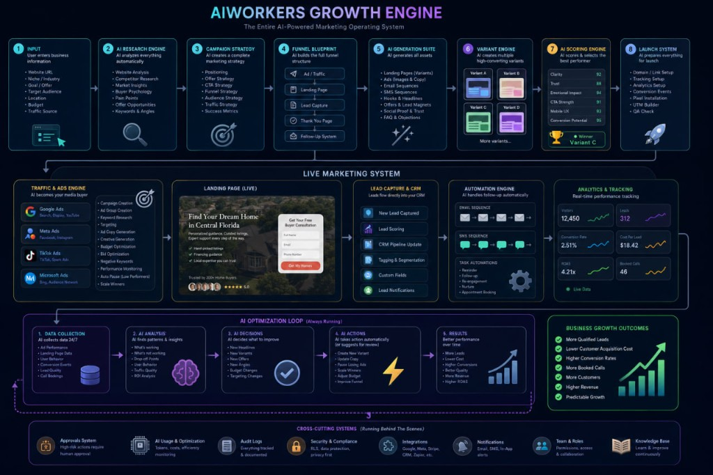

# AIWORKERS Growth Engine — architecture vs implementation

This document maps the **Growth Engine operating-system diagram** (see image below) to concrete code paths in this repository, records **gaps**, and points operators to the **live dashboard** that mirrors the diagram.

---

## Operator dashboard

| Area | Path | Purpose |
|------|------|---------|
| **Growth Engine system map** | `/admin/growth-engine` | Diagram, per-subsystem health (green / amber / red), **Score variants**, **Run optimization loop**. |
| **Workspace** | `/admin/workspace` | End-to-end AI build stream, landing variants card, regenerate. |
| **Ads optimize API** | `POST /api/ads/optimize` | Growth + ads optimization JSON (existing). |
| **New: variant scores** | `POST /api/growth/score-variants` | Heuristic scores (Clarity, Trust, Emotional impact, CTA strength, Mobile-friendly, Conversion potential) → persisted on `campaigns.metadata.growth_engine.variant_scoring`. |
| **New: optimization loop** | `POST /api/growth/optimization-loop` | Collects analytics rollup + runs growth optimizer with enriched metrics → appends to `campaigns.metadata.growth_engine.optimization_loop_cycles`. |
| **New: system status** | `GET /api/growth/system-status?organizationId=&campaignId=` | Read-only JSON for the dashboard tiles. |

---

## Traceability matrix (diagram → code)

| Diagram block | Status | Primary implementation | Notes / gaps |
|---------------|--------|-------------------------|--------------|
| **1 · Input** (URL, niche, goal, audience, location, budget, traffic) | **Partial** | Onboarding + campaign `metadata` (`url`, `goal`, `audience`, `traffic_source`); `POST /api/growth/run` | **Location** is not always a first-class persisted field; budget maps to `growth_engine.daily_budget` after engine run. |
| **2 · AI research engine** | **Implemented** | `src/services/growth/urlResearchService.ts`, pipeline in `runMarketingPipeline` / `runAiGrowthEngine` | Depends on scraper + LLM; failures surface as `needs_generation_fix`. |
| **3 · Campaign strategy** | **Implemented** | `businessClassifierService`, `offerEngineService`, persisted under `campaigns.metadata.growth_engine` | |
| **4 · Funnel blueprint** | **Implemented** | `funnelBuilderService`, `funnels` + `funnel_steps` tables | |
| **5 · AI generation suite** (landings, ads, email, SMS) | **Partial** | Landings: `landing_page_variants`, `landingVariantsService`. Ads: `adsDraftService`, `ad_campaigns`. Email: `email_sequences` | **SMS sequences**: not a dedicated first-class module in this repo; treat as future or content-worker output. |
| **6 · Variant engine** (A/B/C/D) | **Implemented** | `landing_page_variants`, traffic router prompt, `POST /api/growth/select-variant` | Product supports **three** canonical keys in many flows (`direct_response`, `premium_trust`, `speed_convenience`); diagram shows D — **extend keys** if product requires four. |
| **7 · AI scoring engine** (clarity, trust, emotion, CTA, mobile, conversion) | **Implemented (this PR)** | `src/services/growth/variantScoringEngine.ts` + `POST /api/growth/score-variants` | Heuristic **pre-launch** scores; post-launch weighting should blend **live conversion** from `analytics_events` / `ad_performance_events` (future enhancement). |
| **8 · Launch system** (domain, tracking, pixels) | **Partial** | `preparePaidAdsLaunch`, approvals, UTM templates in metadata | **Domain + pixel auto-install** are mostly operator / platform concerns; tracking params exist in funnel + ads flows. |
| **Live · Traffic & ads** | **Implemented** | `ad_campaigns`, providers stub/live, `POST /api/ads/*` | TikTok / Microsoft providers may be stub-level depending on env. |
| **Live · Landing** | **Implemented** | Public funnel `src/app/f/[campaignId]/[stepSlug]/page.tsx` reads **`landing_page_variants.content` only** for landing steps | |
| **Live · Lead CRM** | **Implemented** | `leads`, `POST /api/leads/capture`, pipeline APIs | |
| **Live · Automation** | **Partial** | Email outbox, cron routes, `adsAutoEngine`, automation settings | Full **SMS** automation parity not documented here. |
| **Live · Analytics** | **Implemented** | `analytics_events`, metrics engine, admin analytics | |
| **Optimization loop** (collect → analyze → decide → act → results) | **Implemented (this PR)** | `src/services/growth/growthOptimizationLoop.ts` | **Act** step does **not** auto-execute budget or copy changes; suggestions are stored + returned for **Approvals** and manual / future autopilot rules. |
| **Cross-cutting** (approvals, AI usage, audit, security, integrations) | **Partial** | `approvals`, `auditService`, `logs`, Stripe, Resend, OpenClaw | **Centralized AI usage billing dashboard** per diagram is spread across billing + logs; optional consolidation. |

---

## Key files (quick reference)

| Concern | Path |
|---------|------|
| Full engine orchestration | `src/services/growth/growthEngine.ts` |
| Marketing pipeline (persist funnel + variants) | `src/services/marketing-pipeline/runMarketingPipeline.ts` |
| Landing regeneration + quality gates | `src/services/growth/regenerateLandingVariants.ts`, `landingCopyGuards.ts` |
| Traffic routing AI | `src/services/growth/trafficRouterService.ts`, `src/app/api/traffic/route` |
| Growth optimization LLM | `src/services/growth/optimizationEngineService.ts`, `src/ai/prompts/optimization_engine.prompt.ts` |
| Variant scoring (heuristic) | `src/services/growth/variantScoringEngine.ts` |
| Optimization loop cycle | `src/services/growth/growthOptimizationLoop.ts` |
| System health tiles | `src/services/growth/growthSystemStatus.ts` |

---

## Recommended next upgrades (priority)

1. **Blend live metrics into variant scores** (CTR, lead rate per `variant_key` from `analytics_events.metadata`).
2. **Fourth landing variant** if product standardizes on A/B/C/**D**.
3. **SMS** as first-class sequence storage + worker (or document deferral).
4. **Autopilot execution layer** that turns `suggestedActions` into queued `jobs` with explicit approval gates (never spend without flag + approval).

---

_Last updated: aligned with Growth Engine dashboard and growth API routes in this repository._
